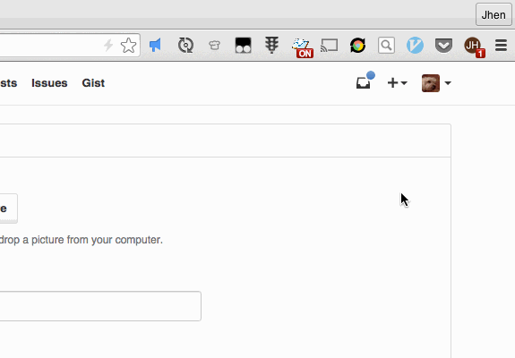
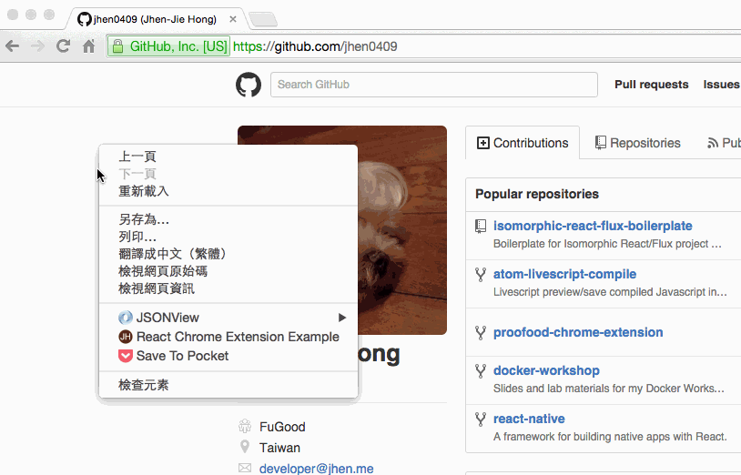

# React Chrome Extension Boilerplate

[](https://travis-ci.org/jhen0409/react-chrome-extension-boilerplate)
[](https://ci.appveyor.com/project/jhen0409/react-chrome-extension-boilerplate/branch/master)
[](https://www.npmjs.com/package/react-chrome-extension-boilerplate)

Boilerplate for Chrome Extension React.js project.

## Features

 - Simple [React](https://github.com/facebook/react)/[Redux](https://github.com/rackt/redux) examples of Chrome Extension Window & Popup & Inject pages
 - Hot reloading React/Redux (Using [Webpack](https://github.com/webpack/webpack) and [React Transform](https://github.com/gaearon/react-transform))
 - Write code with ES2015+ syntax (Using [Babel](https://github.com/babel/babel))
 - E2E tests of Window & Popup & Inject pages (Using [Chrome Driver](https://www.npmjs.com/package/chromedriver), [Selenium Webdriver](https://www.npmjs.com/package/selenium-webdriver))

## Examples

The example is edited from [Redux](https://github.com/rackt/redux) TodoMVC example.

#### Popup



The `todos` state will be saved to `chrome.storage.local`.

#### Window



The context menu is created by `chrome/app/background/contextMenus.js`.

If you want Packaged app, You can edit `manifest.{env}.json`.
```json
...
  "app": {
    "launch": {
      "local_path": "app.html",
      "container": "panel",
      "width": 800,
      "height": 500
    }
  },
...
```

and remove `browser_action`.

#### Inject page

The inject script is being run by `chrome/app/background/inject.js`. A simple example will be inject bottom of page(`https://github.com/*`) if you visit.

## Installation

```bash
# required node.js
# clone it
npm install

# or npm way
npm install react-chrome-extension-boilerplate --dev
```

## Development

* Run script
```bash
# build files to './dev'
# start WebpackDevServer
npm run dev
```
* Allow `https://localhost:3000` connections. (Because `injectpage` injected GitHub (https) pages, so `webpack-dev-server` procotol must be https.)
* [Load unpacked extensions](https://developer.chrome.com/extensions/getstarted#unpacked) with `./dev` folder.

#### React/Redux hot reload

This boilerplate uses `Webpack` and `react-transform`, and use `Redux`. You can hot reload by editing related files of Popup & Window & Inject page.

#### Using Redux DevTools Extension

You can use [redux-devtools-extension](https://github.com/zalmoxisus/redux-devtools-extension) on development mode.

## Build

```bash
# build files to './build'
npm run build
```

## Build & Compress

```bash
# compress build folder to {manifest.name}.crx
npm run compress
```

* You can add custom `key.pem` in main folder.
* If you want autoupdate, you can refer [this](https://github.com/PavelVanecek/gulp-crx#autoupdating) and edit Gulpfile.

## Test

* `test/app`: React components, Redux actions & reducers tests
* `test/e2e`: E2E tests (use [chromedriver](https://www.npmjs.com/package/chromedriver), [selenium-webdriver](https://www.npmjs.com/package/selenium-webdriver))

```bash
# test/app
npm run test-app
npm run test-app-watch  # watch files
# test/e2e
npm run build
npm run test-e2e
# lint & test-app & build & test-e2e
npm test
```

## LICENSE

[MIT](LICENSE)
